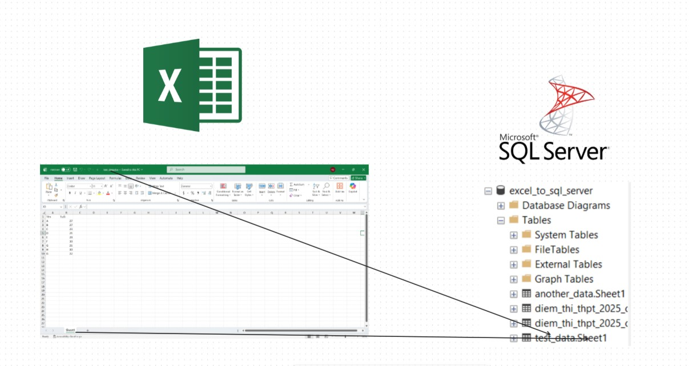

# Excel to SQL Server


## A simple script to load excel file to SQL Server

This is a script loading excel file from data folder into a database inside SQL Server. The name of the database is "excel_to_sql_server" by default and can be change in const.py.
The name of the file with become the schemas name and the name of the sheet become the name of the table.

Technology:
* SQL Alchemy (ORM framwork)
* SQL Server

<center></center>

## How to use this script
Preresiquite:
* Make sure to install python and SQL Server before.

Installation:
* Step 1: Install requirements.txt by command:

```bash
pip install -r requirements.txt
```
* Step 2: Put your interested excel files to data folder

* Step 3: Run main.py by command:
```bash
python -m main
```


